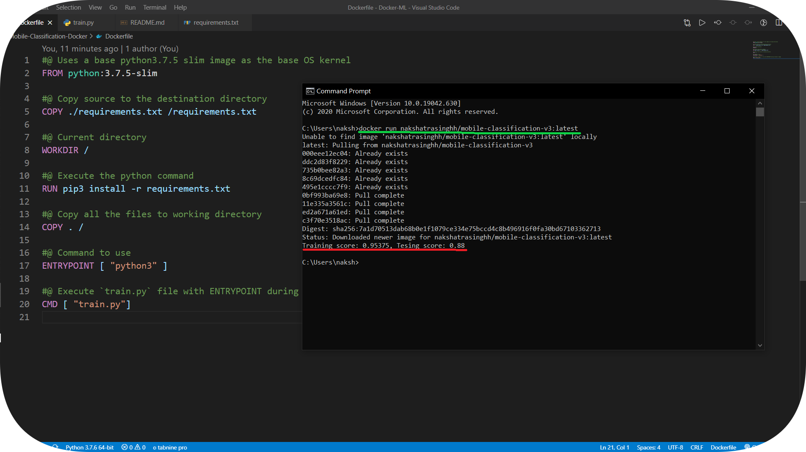
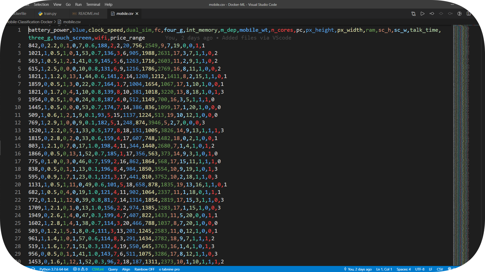
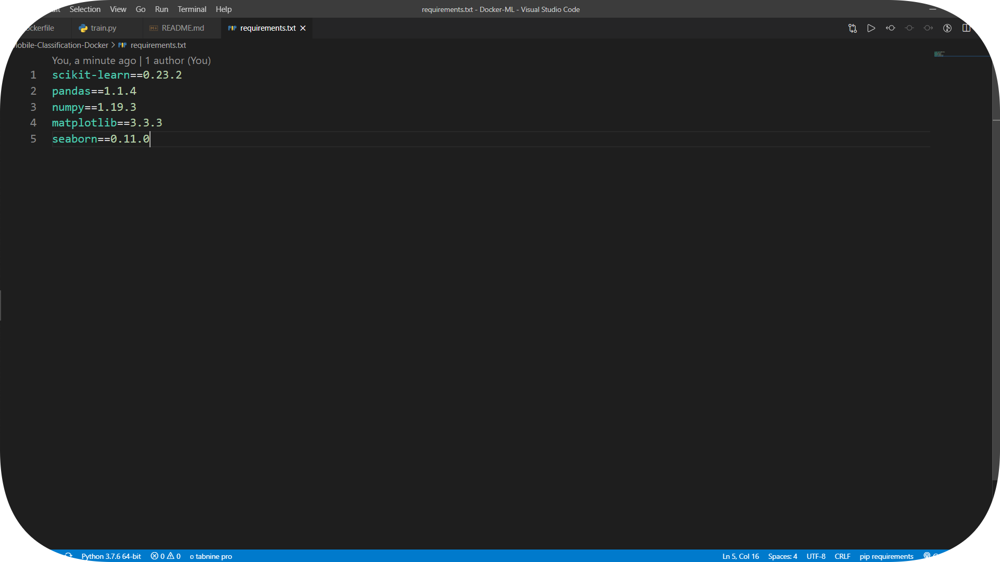
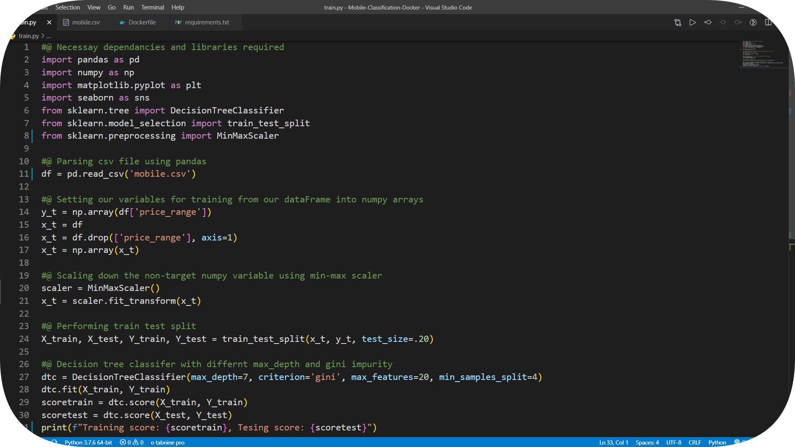
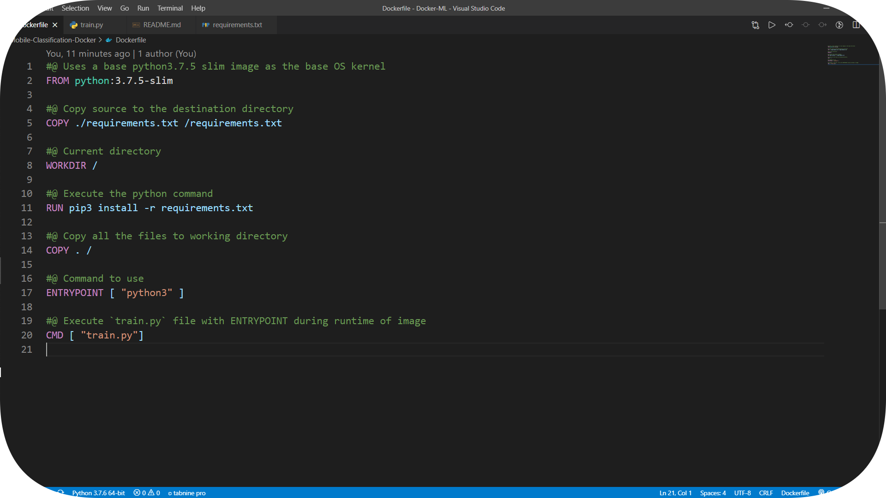
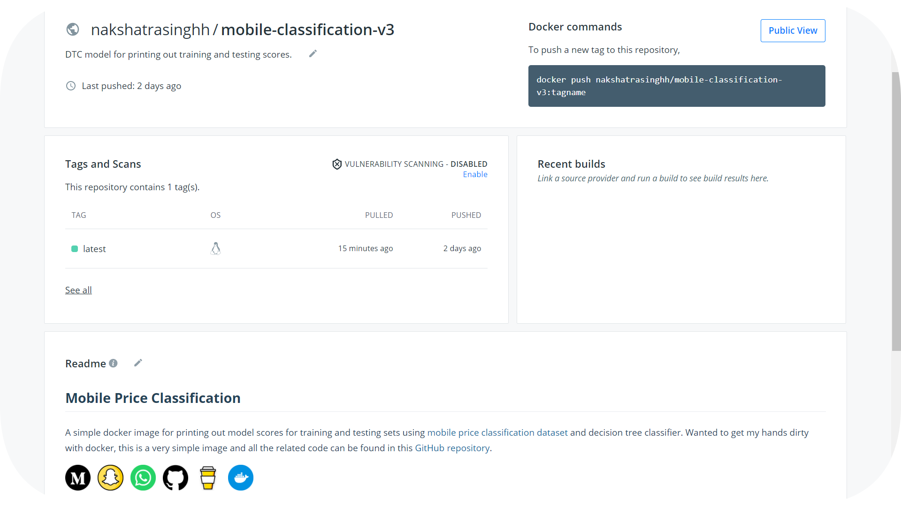

# Mobile Classification- Docker 

A docker image for scoring a simple DTC model on training and testing sets using [Mobile price classification](https://www.kaggle.com/iabhishekofficial/mobile-price-classification) dataset. This is a very simple image which prints out model scores on training and testing sets, scores can vary as `random seed` parameter is not a constant. Green command to be executed to run the image directly in any local machine and red is the output after running the image.



## Dataset

For this project, I have used the [Mobile price classification](https://www.kaggle.com/iabhishekofficial/mobile-price-classification) dataset from kaggle. This is a simple and clean practice dataset for classification modelling. It consists of 2000 rows and 21 columns. The model will be based on “features” like _battery power, bluetooth and n_cores etc_. You can also use feature engineering to create new features. But we won't be dealing with feature engineering in this project. *On the side note, I used the [Rainbow CSV extension](https://marketplace.visualstudio.com/items?itemName=mechatroner.rainbow-csv) for VS-code to make .csv files look more attractive 😅*. The dataset can be viewed [here](https://github.com/nakshatrasinghh/Mobile-Classification-Docker/blob/main/mobile.csv).



## Requirements & Training script



⚠️ All the necessary [packages](https://github.com/nakshatrasinghh/Mobile-Classification-Docker/blob/main/requirements.txt) must be installed using pip in order to train the model. ⚠️ Decision Tree Classifier was used to train the model. Training and testing scores of dtc model were printed out. Detailed code of the training script with comments [here](https://github.com/nakshatrasinghh/Mobile-Classification-Docker/blob/main/train.py).



## Dockerfile

To create docker images and run them in containers, you need to have a [dockerfile](https://github.com/nakshatrasinghh/Mobile-Classification-Docker/blob/main/Dockerfile) which includes all the commands to be executed sequential for the application to run in the base OS kernel (in this case, Ubuntu). Firstly, we'll use a basic linux OS kernel with [python 3.7.5-slim edition](https://hub.docker.com/_/python) (keeps the image size small and very portable across different computers). 

⚠️***This image does not contain the common packages contained in the default tag and only contains the minimal packages needed to run python. Unless you are working in an environment where only the python image will be deployed and you have space constraints, it's highly recommend using the default image of this repository.*** ⚠️



Secondly, we copy the requirements.txt file in the root director, move to the root directory and pip install all the requirements. Finally, we execute python3 command along with the file we need to execute for tha application to run.  

## Docker Commands

**```docker build -t mobile-classification-v3:latest . ```**

Docker [build command](https://docs.docker.com/engine/reference/commandline/build/) will build the docker image for us, `docker build -t <image-name>:<tag> .`, here -t stands for tag. Tag is used to version the docker images in deployement phase. The  default tag is latest. **Make sure you are in the working directory of the project.**

**```docker run --name mobile-classification-test --rm mobile-classification-v3:latest```**

Docker [run command](https://docs.docker.com/engine/reference/commandline/run/) will run the docker image in a docker container for us, `docker build --name <container-name>:<tag> .`, here --name stands to container name, --rm automatically removes the container when it exits

**```docker commit <container-id> <dockerhub-username>/<repo-name>```**

Docker [commit command](https://docs.docker.com/engine/reference/commandline/commit/) will commit the the unstaged changed and prepare the changes to be pushed in docker hub repositories. 

**```docker login```**

Docker [login command](https://docs.docker.com/engine/reference/commandline/login/) will setup the credentials to log in to a Docker registry.

**```docker push <newly-created-image-name>```**

Docker [push command](https://docs.docker.com/engine/reference/commandline/push/) will push the staged changes to docker cloud.



## Docker Hub
Click the icon below to checkout the docker registry, just execute **`docker run nakshatrasinghh/mobile-classification-v3:latest`** on cmd and have the results right at your terminal without any training requirements. Make sure you have [docker](https://hub.docker.com/editions/community/docker-ce-desktop-windows/) installed.

<p align='left'>
  <a href="https://hub.docker.com/repository/docker/nakshatrasinghh/mobile-classification-v3"></a>&nbsp;&nbsp;
 </p>

## Message Me
If you have any doubts feel free to click on the social icon you would like to connect with 🤗
<p align="left">
<a href="https://www.linkedin.com/in/nakshatrasinghh/"></a>&nbsp;&nbsp;
<a href="https://github.com/nakshatrasinghh"></a>&nbsp;&nbsp;
<a href="https://www.snapchat.com/add/nxkshxtrx.singh"></a>&nbsp;&nbsp;
<a href="https://wa.link/8bt67v"></a>&nbsp;&nbsp;
</p>

## Support Me
If you liked my work and gained **insightful knowledge**, you can buy me a coffee buying click the button below 😊

<a href="https://www.buymeacoffee.com/nakshatrasinghh" target="_blank"></a>


